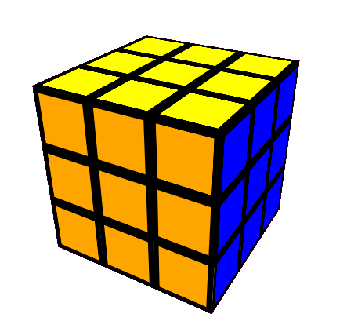
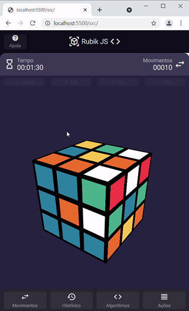
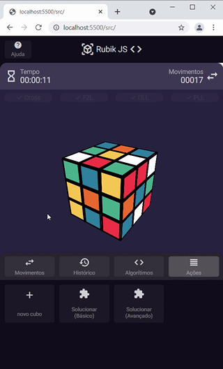
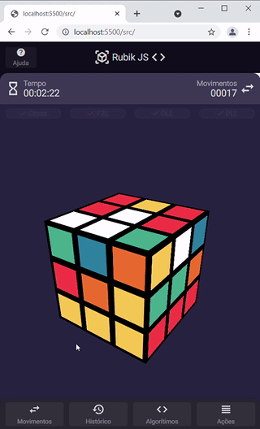
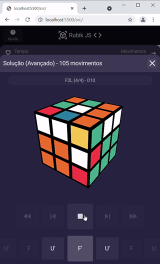

# Rubik JS

* [Introdução](#introdução)
* [Instruções](#intrucoes)
* [Implementações Futuras](#implementações-futuras)

## Introdução
Projeto realizado em Vanilla Javascript a fim de estudo, com a ideia de criar um aplicativo web que forneça um [cubo de Rubik](https://pt.wikipedia.org/wiki/Cubo_de_Rubik) para o usuário interagir e montar, oferencendo dicas de movimento baseados no algoritimo do [método de Fridrich (CFOP)](https://cubovelocidade.com.br/tutorial/cubo-magico-3x3x3-metodo-avancado-fridrich-cfop/)

## Instruções

### Movimentação

Segure e arraste a peça na a direção desejada.

Para movimentar o cubo inteiro, segure e arraste no espaço fora do cubo.

### Novo cubo

Entre no menu __Ações__ e clique em __Novo cubo__.

É possível criar um novo cubo pelo opção __Escanear__, onde utilizará a câmera para para identificar as faces do cubo, ou criar um cubo __aleatório__, ou editar um cubo pela opção __Editar__ 

### Algorítimos

Pela opção __algorítimos__, é possivel acessar todos os algorítimos do método Fridrich, separados por etapas, e basico ou avançado.

### Solucionar

Dentro da menu __Ações__ é possivel acessar a opção __Solucionar (Básico)__ e __Solucionar (Avançado)__, onde sera apresentado passo a passo a solução do cubo atual, junto do nome do algorítimo utilizado.

## Implementações Futuras
- [X] Cubo
- [X] Rotacionar
- [x] Comandos
- [x] Segura/Arrasta/Solta
- [x] Algoritimos
- [X] Solucionar
- [ ] Salvar/Carregar
- [ ] Dica
- [ ] Ajustar Icones
- [ ] Conquistas
- [ ] Treino
- [ ] Ler cubo por video
- [ ] Ajuda
- [ ] Ranking